# UnityProje
# **Takım İsmi**

Unity Takım - 3

# Ürün İle İlgili Bilgiler

## Takım Elemanları

•    Berkay Aydın: Product Owner

•    Aleyna Nur Kılıç: Scrum Master

•    Cihan Eray Bozkurt: Team Member/Developer

•    Furkan Zengin: Team Member/Developer

## Ürün İsmi

Procyon

## Ürün Açıklaması

- Oyunumuz bir robotun kaçış hikayesini anlatan coop destekli puzzle platform oyunudur. Gravity ve Rainbow  adlı iki silah modu bulunmaktadır. Gravity özelliği objeleri çeker ve atar. Rainbow özelliği ise objelerin rengini değiştirir.

## Ürün Özellikleri

- Puzzle 
- FPS
- Photon Network  kullanılarak  online özelliği
- 3D 

## Hedef Kitle

- Puzzle sevenler
- FPS sevenler
- Her yaştan oyuncular
- Coop sevenler

## Product Backlog URL
 [Miro Backlog Board ] https://miro.com/app/board/uXjVO2kPvZ0=/

# Sprint 1

**Sprint Notları**: User Story'ler product backlog'ların içine yazılmıştır. Product backlog item'lara tıklandığında hikayelerin detayları okunabilir.

- **Sprint içinde tamamlanması tahmin edilen puan**: 100 Puan

- **Puan tamamlama mantığı**: Toplamda proje boyunca tamamlanması gereken 400 puanlık backlog bulunmaktadır. 3 sprint'e bölündüğünde ilk sprint'in en azından 100 ile başlaması gerektiğine karar verildi. Bu sprintte her bir backlog 25 puan üzerinden değerlendirildi.

- **Backlog düzeni ve Story seçimleri**
    - Story'ler yapılacak task'lere bölünmüştür. 
    - Miro Board'da gözüken kırmızı item'lar Backend taskları gösterirken, mavi itemlar Frontend taskleri temsil ediyor. Mor itemlar story'leri temsil ediyor.
    
- **Daily Scrum :** Daily Scrum toplantıları çoğunlukla Discord  üzerinden yapılmıştır. Ara ara Whatsapp'ta kullanılmıştır. Daily Scrum toplantısı örneği png olarak Readme'de tarafımızdan paylaşılmaktadır : https://github.com/UnityTakim3/UnityProje/blob/main/ProjectManagement/Sprint1Document/DailyScrum_meet_1.png
https://github.com/UnityTakim3/UnityProje/blob/main/ProjectManagement/Sprint1Document/DailyScrum_meet_2.png
https://github.com/UnityTakim3/UnityProje/blob/main/ProjectManagement/Sprint1Document/DailyScrum_meet_3.png
https://github.com/UnityTakim3/UnityProje/blob/main/ProjectManagement/Sprint1Document/DailyScrum_meet_4.png

- **Sprint board update**: Sprint board screenshotları: 

 
  
 
 

- **Ürün Durumu**: Ekran görüntüleri:
 
 
 
 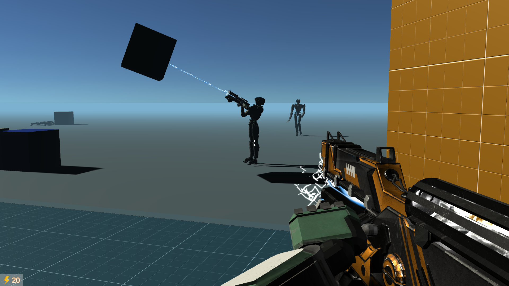

- **Sprint Review:**

  -Alınan kararlar: Oyunun bulmaca kısmına odaklanmak için düşman eklemekten şimdilik vazgeçtik/erteledik. Ekstra konulması gereken özellikler ve görevler belirlenmiştir. Yapılan son testlerde oyunda bir sorun tespit edilmemiştir.
                     
  

- **Sprint Retrospective:**
  - Takım içindeki görev dağılımıyla ilgili düzenleme yapılması kararı alınmıştır.
  - Takım içi iletişimin daha fazla arttırılmalı.
  - Testler için ayrılan efor/saat arttırılmalı .

-**Diğer Notlar**:
- N/A

---

# Sprint 2

- **Sprint içinde tamamlanması tahmin edilen puan**: 100 Puan

- **Puan tamamlama mantığı**: Toplamda proje boyunca tamamlanması gereken 400 puanlık backlog bulunmaktadır. İkinci sprintte  100 puan olarak  kararlaştırıldı. Bu sprinttede  her bir backlog 25 puan olarak tanımlandı.

- **Backlog düzeni ve Story seçimleri**
    - Story'ler yapılacak  task'lere bölünmüştür. 
    - Miro Board'da gözüken kırmızı item'lar  Backend taskları gösterirken, mavi itemlar  Frontend taskleri temsil ediyor. Mor  itemlar story'leri temsil ediyor.

- **Daily Scrum :** Daily Scrum toplantıları çoğunlukla Discord  üzerinden yapılmıştır. Ara ara Whatsapp'ta kullanılmıştır. Daily Scrum toplantısı örneği png olarak Readme'de tarafımızdan paylaşılmaktadır :
  https://github.com/UnityTakim3/UnityProje/blob/main/ProjectManagement/Sprint2Document/DailyScrum_meet_1.png
  https://github.com/UnityTakim3/UnityProje/blob/main/ProjectManagement/Sprint2Document/DailyScrum_meet_2.png
  https://github.com/UnityTakim3/UnityProje/blob/main/ProjectManagement/Sprint2Document/DailyScrum_meet_3.png
  https://github.com/UnityTakim3/UnityProje/blob/main/ProjectManagement/Sprint2Document/DailyScrum_meet_4.png

- **Sprint board update**: Sprint board screenshotları: 
   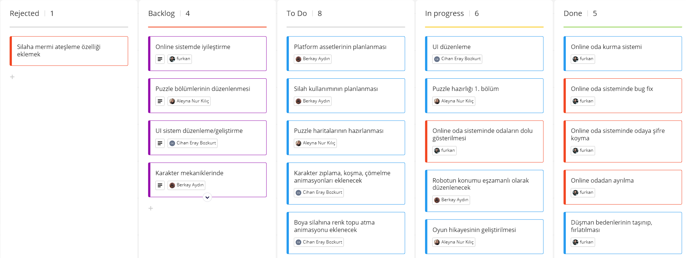
   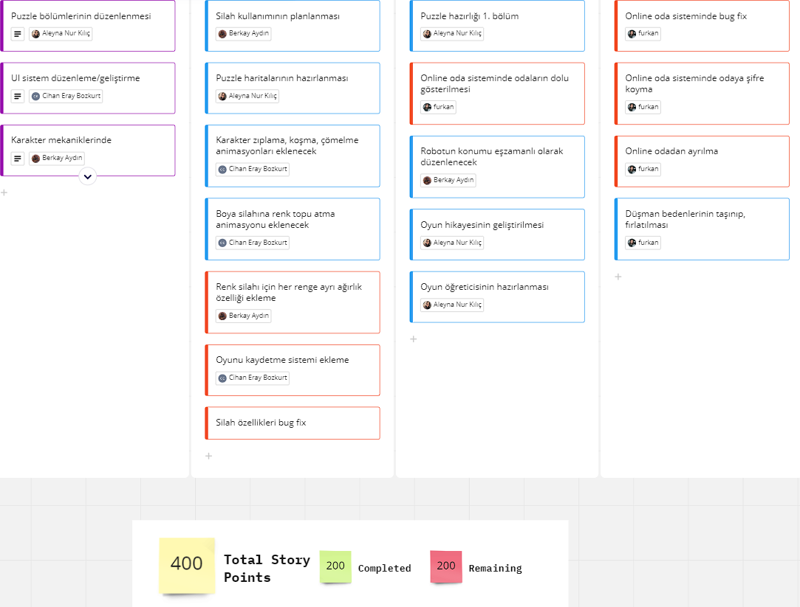
   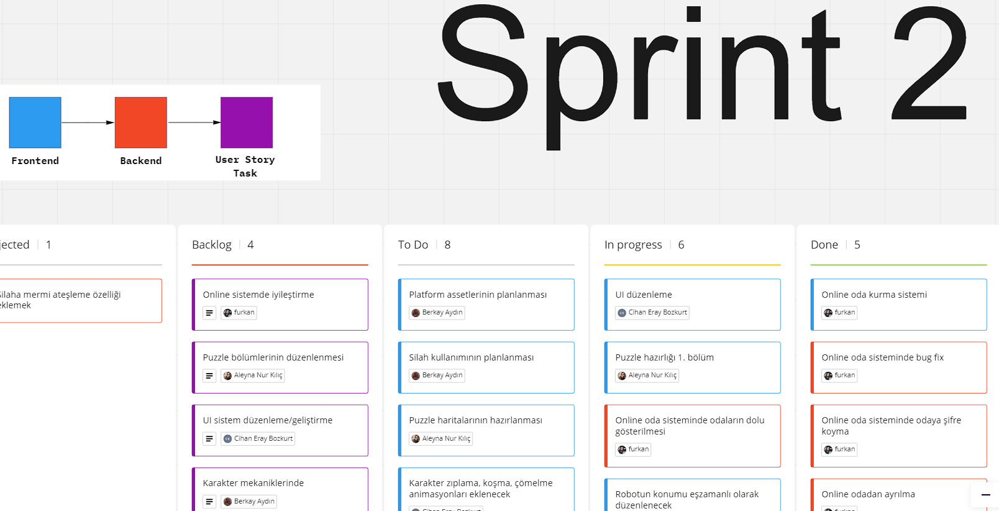

- **Ürün Durumu**: Ekran görüntüleri:
 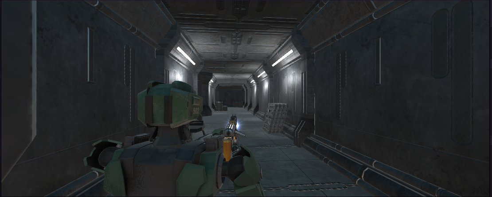
  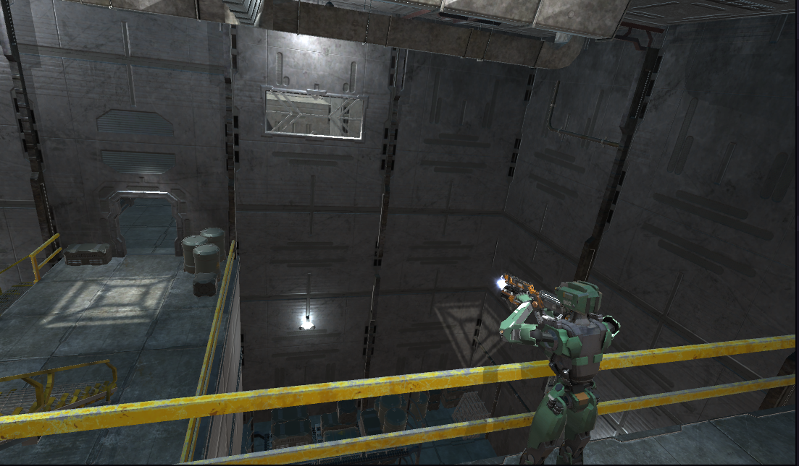
   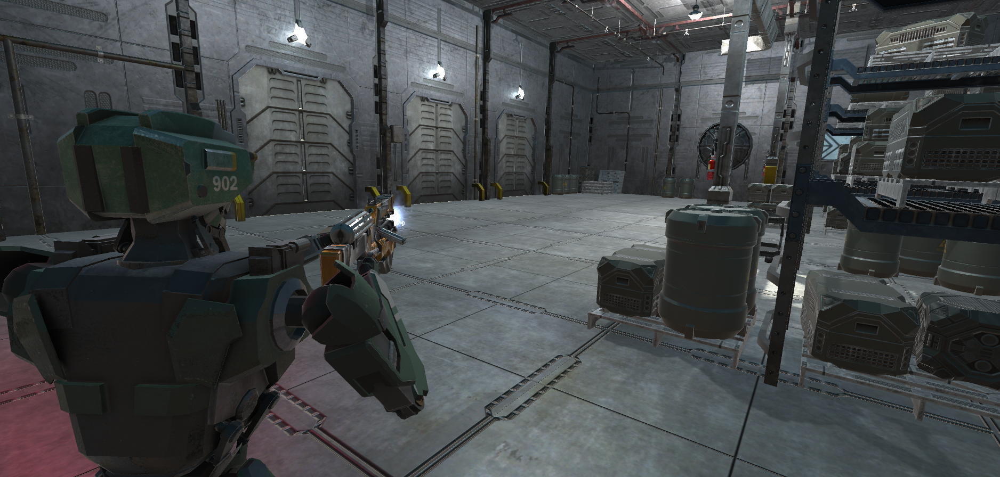
    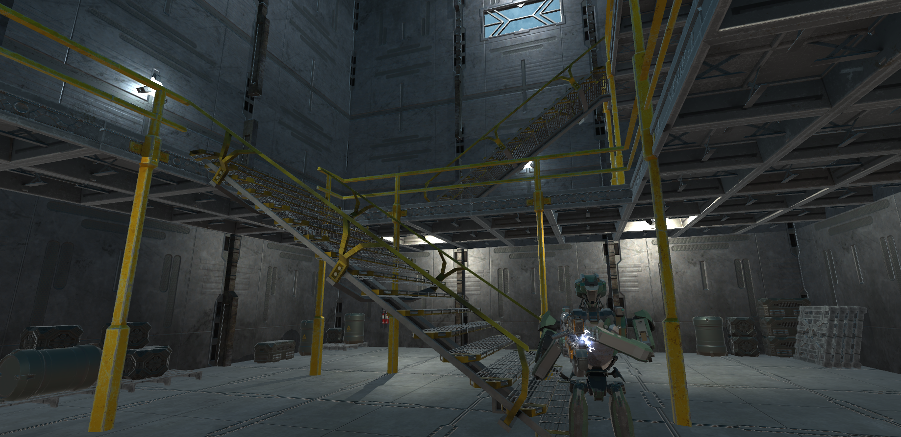
     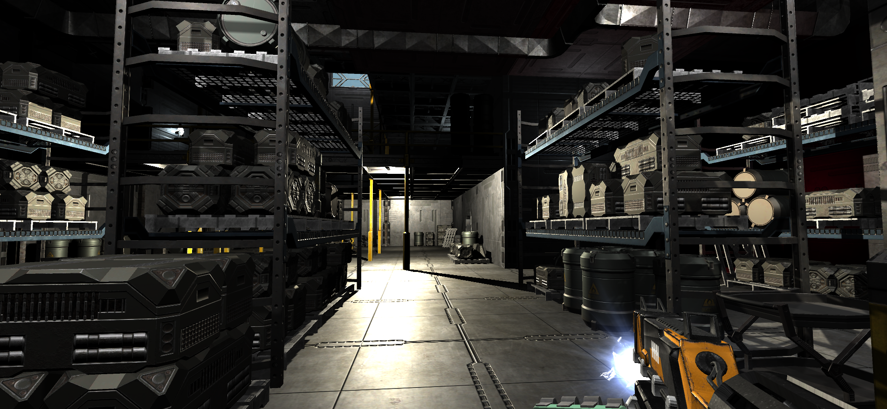
      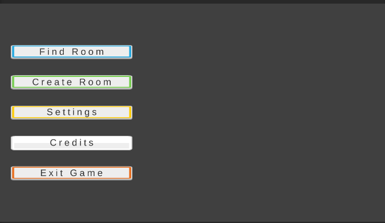
       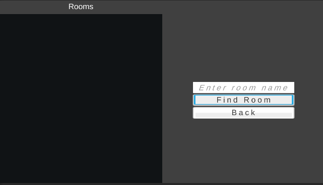

- **Sprint Review:**

  -Alınan kararlar: Online deneyimin geliştirilmesi ve puzzle ögelerine daha çok vakit ayırma. Silaha mermi özelliği iptal edildi. UI üzerinde geliştirmelerin yapılması.

- **Sprint Retrospective:**
  -  Proje kapsamında zaman yönetimi daha iyi yapılmalı.
 

---

# Sprint 3

- **Sprint içinde tamamlanması tahmin edilen puan**: 200 Puan

- **Puan tamamlama mantığı**: Toplamda proje boyunca tamamlanması gereken 400 puanlık backlog bulunmaktadır. Üçüncü sprintte  200 puan olarak  kararlaştırıldı. Bu sprinttede  her bir backlog 40 puan olarak tanımlandı.

- **Backlog düzeni ve Story seçimleri**
   
   - Story'ler yapılacak  task'lere bölünmüştür. 
    
    - Miro Board'da gözüken kırmızı item'lar  Backend taskları gösterirken, mavi itemlar  Frontend taskleri temsil ediyor. Mor  itemlar story'leri temsil ediyor 
    

- **Daily Scrum :** Daily Scrum toplantıları çoğunlukla Discord  üzerinden yapılmıştır. Ara ara Whatsapp'ta kullanılmıştır. Daily Scrum toplantısı örneği png olarak Readme'de tarafımızdan paylaşılmaktadır :
https://github.com/UnityTakim3/UnityProje/blob/main/ProjectManagement/Sprint3Document/DailyScrum_meet_1.png
https://github.com/UnityTakim3/UnityProje/blob/main/ProjectManagement/Sprint3Document/DailyScrum_meet_2.png
https://github.com/UnityTakim3/UnityProje/blob/main/ProjectManagement/Sprint3Document/DailyScrum_meet_3.png
https://github.com/UnityTakim3/UnityProje/blob/main/ProjectManagement/Sprint3Document/DailyScrum_meet_4.png
https://github.com/UnityTakim3/UnityProje/blob/main/ProjectManagement/Sprint3Document/DailyScrum_meet_5.png

- **Sprint board update**: Sprint board screenshotları: 
-   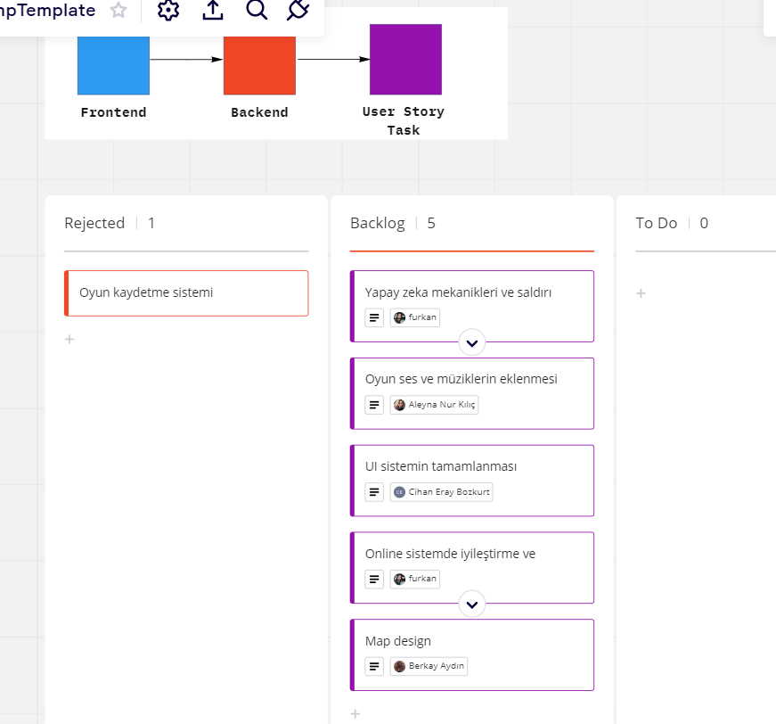

-    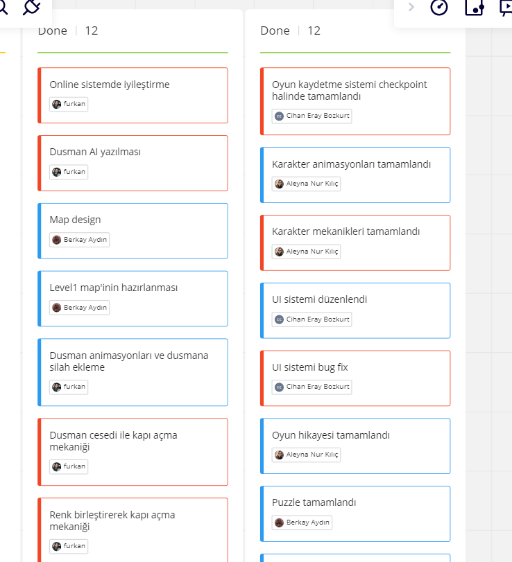

- **Ürün Durumu**: Ekran görüntüleri:
- 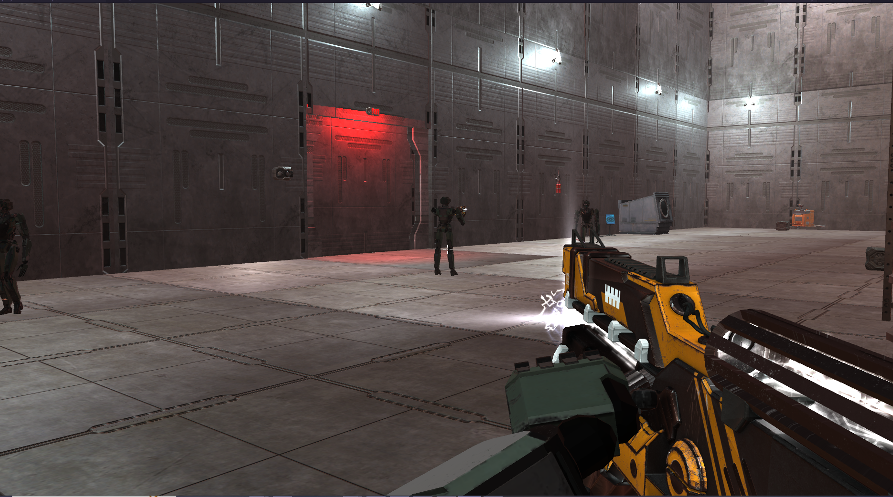
- 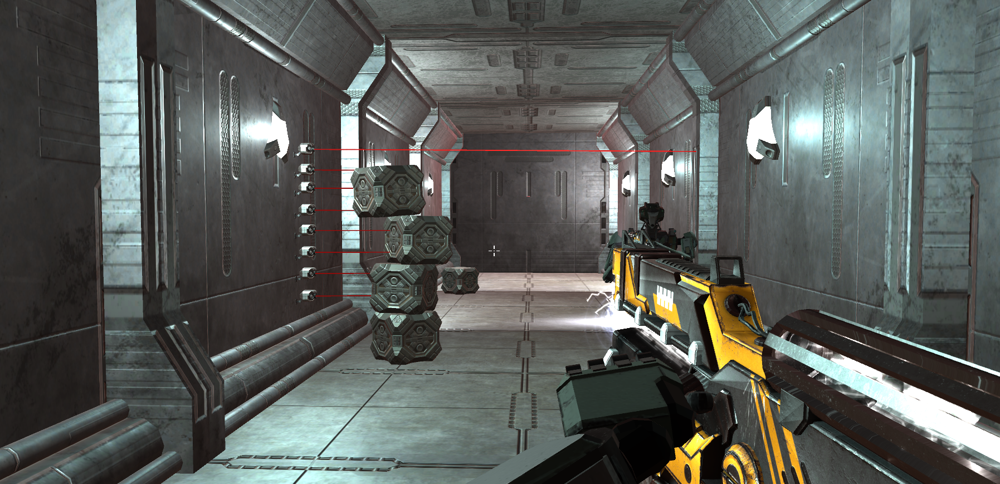
- 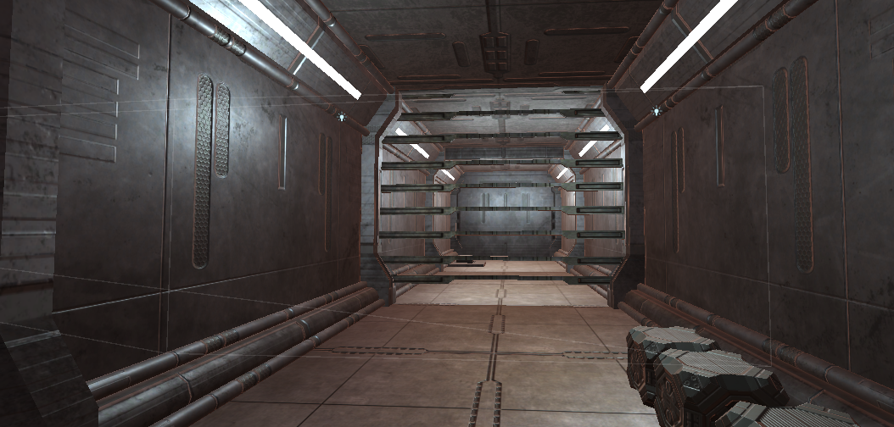
- 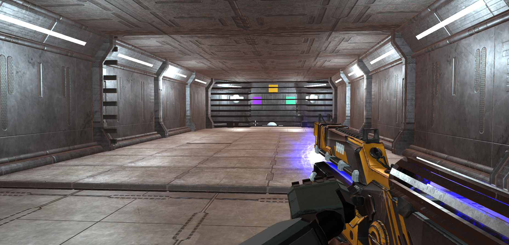
- 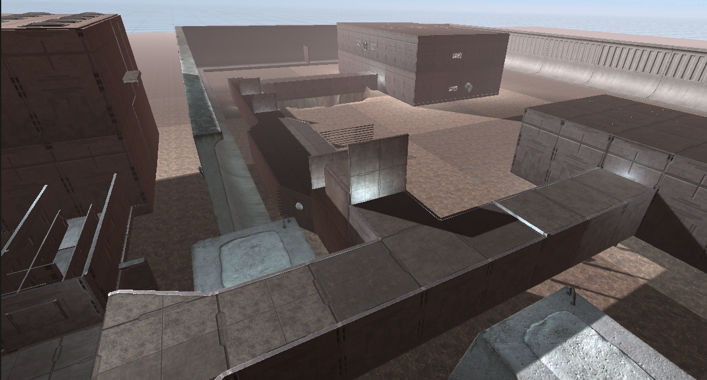
- 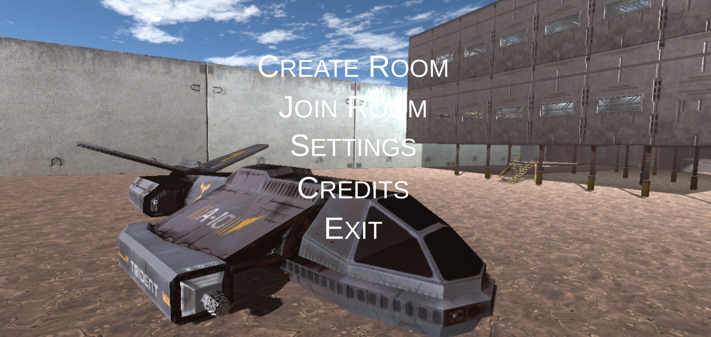

- **Sprint Review:**

  -Alınan kararlar: Puzzlelara öncelik.

- **Sprint Retrospective:**
  -  Proje kapsamında zaman yönetimi ve  görev dağılımı daha iyi yapılmalı.

---
# Assetler
- **Environment  / Environment  Sound:**
- Sci-Fi Construction Kit (Modular) -----> Unity Assets Store/Sickhead Games  
- Object Impact Sound  ----->https://www.fesliyanstudios.com/royalty-free-sound-effects-download/big-metal-hits-and-impact-122 
- Door Open Sound -----> https://freesound.org/people/NeoSpica/sounds/425090/
- Door Close Sound -----> https://freesound.org/people/Paul368/sounds/264060/  
- Broken Door Sound  ----->https://freesound.org/people/Paul368/sounds/264061/
- Door  Checker Correct Sound -----> https://freesound.org/people/StavSounds/sounds/546082/
- Door  Checker Reject Sound  -----> https://freesound.org/people/Paul368/sounds/264060/ 
- Platform Sound -----> https://freesound.org/people/Deathscyp/sounds/404050/
- Countdown Sound -----> https://freesound.org/people/sonically_sound/sounds/612873/   
- Puzzle Start -----> https://freesound.org/people/MATRIXXX_/sounds/523763/  
- Server Asset -----> https://www.cgtrader.com/free-3d-models/electronics/computer/servers
- Screen display  -----> https://www.cgtrader.com/jon-knutton
- Machine asset  -----> https://www.cgtrader.com/pancalas
- Forklift-----> https://freesound.org/people/Paul368/sounds/264060/
- Space ship  -----> https://www.turbosquid.com/By jamesblake3d
- **Guns / Guns Effects / Guns Sound**
- Cyborg Weapon model -----> turbosquid.com by Enalrem
- Unity Particle Pack -----> Unity Technologies
- DL Fantasy RPG Effects -----> UnityAssetStore/dreamlevel
- Change Gun Sound-----> https://freesound.org/people/Dpoggioli/sounds/196907/
- Color Gun Sound -----> thttps://freesound.org/people/steshystesh/sounds/336501/
- Color Gun Hit Sound -----> https://freesound.org/people/DirectD3D/sounds/555129/
- Gravity Pull-----> mixkit.co/ electricity/Electricity buzz
- Gravity Throw-----> freesound.org/Nox_Sound/sounds/466044/ --- zapsplat.com / Science fiction laser hit, impact with a thud 2
-  **Character / Character Sound**
-  Footstep -----> https://freesound.org/people/GiocoSound/sounds/421134/ 
-  Cat Walk Sound-----> https://freesound.org/people/patchytherat/sounds/530987/
-  Enemy Attack Sound-----> https://www.zapsplat.com/music/punch-to-the-body-fast-swipe-whoosh-into-a-clothing-hit-2/
-  **Music**
-  Credit -----> pixabay.com/ Stringer Bell/ Superhero Cinematic

