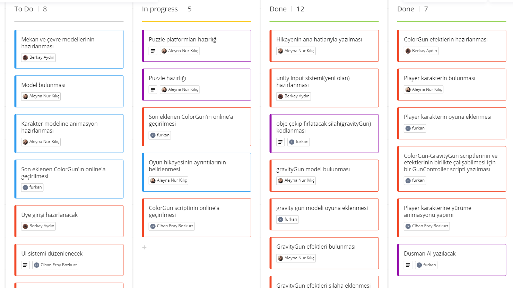
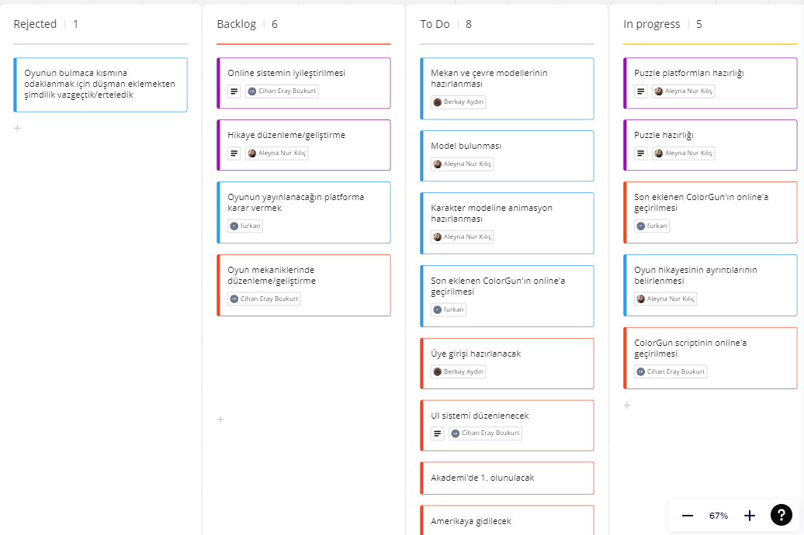
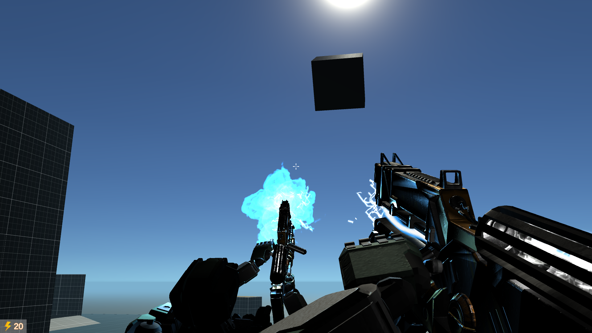
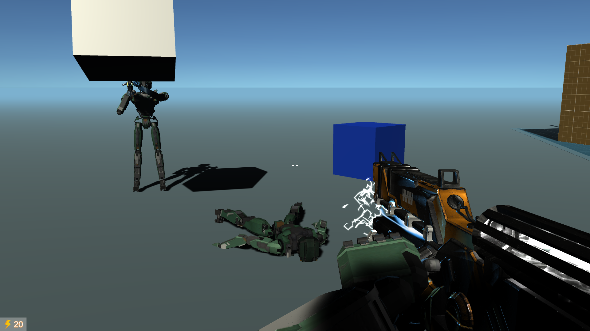
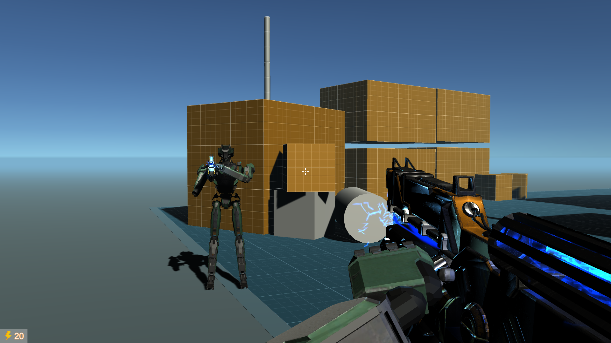

# UnityProje
# **Takım İsmi**

Unity Takım - 3

# Ürün İle İlgili Bilgiler

## Takım Elemanları

•    Berkay Aydın: Product Owner

•    Aleyna Nur Kılıç: Scrum Master

•    Cihan Eray Bozkurt: Team Member/Developer

•    Furkan Zengin: Team Member/Developer

## Ürün İsmi

Berlirlenmedi

## Ürün Açıklaması

- Oyunumuz bir robotun kaçış hikayesini anlatan  coop destekli puzzle platform oyunudur. Gravity ve Rainbow  adlı iki silah modu bulunmaktadır. Gravity özelliği objeleri çeker ve atar. Rainbow özelliği ise  objelerin rengini değiştirir.

## Ürün Özellikleri

- Puzzle - FPS
- Photon Network  kullanılarak  online özelliği
- 3D 

## Hedef Kitle

- Puzzle sevenler
- FPS sevenler
- Her yaştan oyunucular
- Coop sevenler

## Product Backlog URL
 [Miro Backlog Board ] https://miro.com/app/board/uXjVO2kPvZ0=/

# Sprint 1

**Sprint Notları**: User Story'ler product backlog'ların içine yazılmıştır. Product backlog item'lara tıklandığında hikayelerin detayları okunabilir.

- **Sprint içinde tamamlanması tahmin edilen puan**: 100 Puan

- **Puan tamamlama mantığı**: Toplamda proje boyunca tamamlanması gereken 400 puanlık backlog bulunmaktadır. 3 sprint'e bölündüğünde ilk sprint'in en azından 100 ile başlaması gerektiğine karar verildi. Bu sprintte her bir backlog 25  puan üzerinden değerlendirildi.

- **Backlog düzeni ve Story seçimleri**
    - Story'ler yapılacak  task'lere bölünmüştür. 
    - Miro Board'da gözüken kırmızı item'lar  Backend taskları gösterirken, mavi itemlar  Frontend taskleri temsil ediyor. Mor  itemlar story'leri temsil ediyor.
    
- **Daily Scrum :** Daily Scrum toplantıları çoğunlukla Discord  üzerinden yapılmıştır. Ara ara Whatsapp'ta kullanılmıştır. Daily Scrum toplantısı örneği png olarak Readme'de tarafımızdan paylaşılmaktadır : https://github.com/UnityTakim3/UnityProje/blob/main/ProjectManagement/Sprint1Document/DailyScrum_meet_1.png
https://github.com/UnityTakim3/UnityProje/blob/main/ProjectManagement/Sprint1Document/DailyScrum_meet_2.png
https://github.com/UnityTakim3/UnityProje/blob/main/ProjectManagement/Sprint1Document/DailyScrum_meet_3.png
https://github.com/UnityTakim3/UnityProje/blob/main/ProjectManagement/Sprint1Document/DailyScrum_meet_4.png

- **Sprint board update**: Sprint board screenshotları: 

 
  
 
 

- **Ürün Durumu**: Ekran görüntüleri:
 
 
 
 

- **Sprint Review:**

  -Alınan kararlar:  Oyunun bulmaca kısmına odaklanmak için düşman eklemekten şimdilik vazgeçtik/erteledik .Ekstra konulması gereken özellikler ve görevler belirlenmiştir. Yapılan son testlerde  oyunda  bir sorun tespit edilmemiştir.
                     
  

- **Sprint Retrospective:**
  - Takım içindeki görev dağılımıyla ilgili düzenleme yapılması kararı alınmıştır.
  - Takım içi  iletişimin daha fazla arttırılmalı.
  - Testler için ayrılan efor/saat arttırılmalı .

-**Diğer Notlar**:
- N/A

---

# Sprint 2

---

# Sprint 3

---
